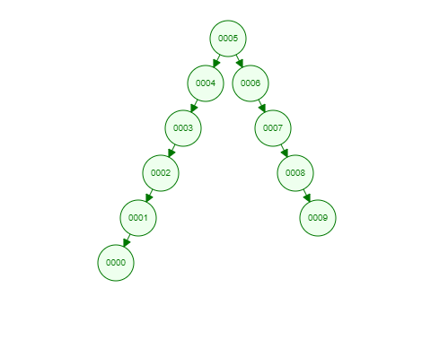

# Binary-Search-Tree

## [7, 5, 1, 8, 3, 6, 0, 9, 4, 2] dizisinin Binary-Search-Tree aşamaları

Binary Search bu diziyi manipüle ederek şu ifadeye dönüştürür [0,1,2,3,4,5,6,7,8,9].

5'i root alırsak 5'ten büyük sayılar 5'in sağına, 5'ten küçük sayılar 5'in soluna gelecektir.

